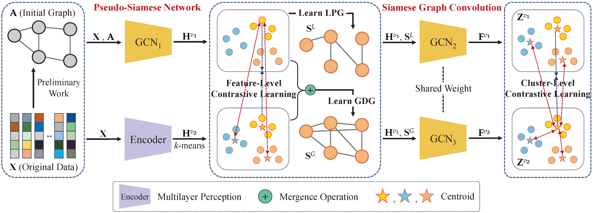

# Deep Contrastive Graph Learning (AAAI-24)

The code for "Deep Contrastive Graph Learning with Clustering-Oriented Guidance" (DCGL).




## Run DCGL

```python
Python main.py
```

The proposed DCGL is implemented with Python 3.8.1 on Pytorch framework.   
You can set "KMrep=10 in the spectral_clustering function" to approximately reproduce the original results.  

torch==1.13.1  
numpy==1.23.5  
scikit_learn==1.2.0  
scipy==1.9.3  
  
## Citation

```
@inproceedings{DCGL,
	author       = {Mulin Chen and Bocheng Wang and Xuelong Li},
	title        = {Deep Contrastive Graph Learning with Clustering-Oriented Guidance},
	booktitle    = {Proceedings of the AAAI Conference on Artificial Intelligence},
	pages        = {11364--11372},
	year         = {2024}
}
```

